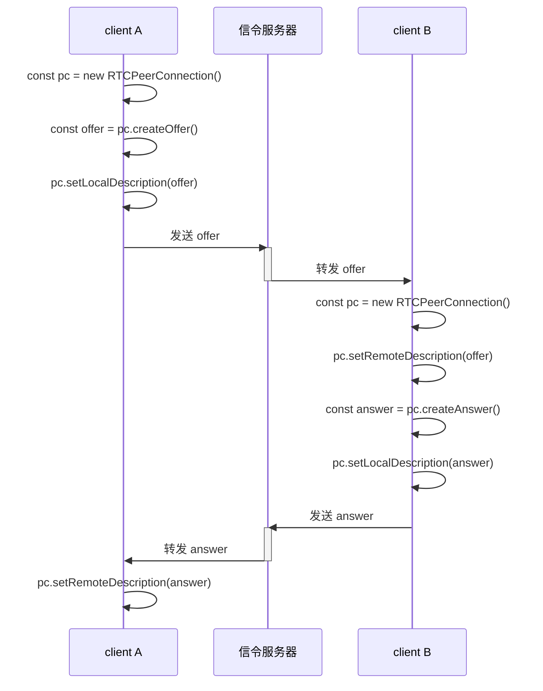

# markdown

```mermaid
sequenceDiagram
    participant Publisher as client A
    participant Signaling as 信令服务器
    participant Subscriber as client B
    
    Publisher->>Publisher: const pc = new RTCPeerConnection()
    Publisher->>Publisher: const offer = pc.createOffer()
    Publisher->>Publisher: pc.setLocalDescription(offer)
    Publisher->>Signaling: 发送 offer
    activate Signaling
    Signaling->>Subscriber: 转发 offer
    deactivate Signaling
    Subscriber->>Subscriber: const pc = new RTCPeerConnection()
    Subscriber->>Subscriber: pc.setRemoteDescription(offer)
    Subscriber->>Subscriber: const answer = pc.createAnswer()
    Subscriber->>Subscriber: pc.setLocalDescription(answer)
    Subscriber->>Signaling: 发送 answer
    activate Signaling
    Signaling->>Publisher: 转发 answer
    deactivate Signaling
    Publisher->>Publisher: pc.setRemoteDescription(answer)
```
